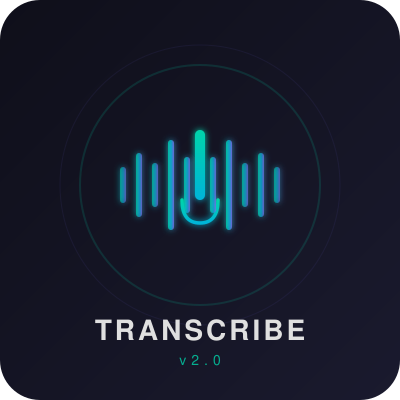

<p align="center">
  
</p>

<h1 align="center">Real-Time Transcription</h1>
<p align="center"><strong>Live speech-to-text with Silero VAD and Faster-Whisper, featuring audio preprocessing, noise reduction, and hallucination filtering</strong></p>

<p align="center">
  
  
  
  
</p>

---

## Overview

A real-time audio transcription system that captures speech from your microphone, detects voice activity, and transcribes it on the fly. Version 2.0 is a complete rewrite of the [original pipeline](https://github.com/Davide-Bonn/real-time-transcription) with 18 improvements targeting accuracy, noise handling, and transcription quality.

## Features

- **Audio Preprocessing Pipeline** -- High-pass filter, spectral gating noise reduction, pre-emphasis, dynamic range compression, and VAD-precise trimming
- **Smart Speech Detection** -- Dynamic silence threshold that grows with speech duration (0.3s - 1.5s), tuned VAD parameters, and a 30s max segment cap
- **Accurate Transcription** -- Context chaining, hallucination filtering, repetition penalty, segment overlap, and model warm-up
- **Live Terminal Display** -- Color-coded state indicator (IDLE / LISTENING / RECORDING / PROCESSING) with real-time transcript rendering

## Installation

```bash
git clone https://github.com/Davide-Bonn/real-time-transcription-v2.git
cd real-time-transcription-v2
pip install -r requirements.txt
```

FFmpeg is also required:
```bash
# Windows (Chocolatey)
choco install ffmpeg

# Linux
sudo apt install ffmpeg

# macOS
brew install ffmpeg
```

## Usage

```bash
python rec_speak_trans.py
```

Press `Ctrl+C` to stop. On exit, the system combines all segments into `combined_recording.wav` and saves the transcript to `transcripts/`.

## How It Works

```
Microphone ─> Audio Buffer ─> Silero VAD (speech detection)
                                    │
                              ┌─────┴──────┐
                              │  Speech?    │
                              └─────┬──────┘
                                Yes │
                                    ▼
                            Save .wav segment
                                    │
                                    ▼
                    ┌───────────────────────────────┐
                    │   Audio Preprocessing Pipeline │
                    │  ┌─────────────────────────┐  │
                    │  │ High-pass filter (80Hz)  │  │
                    │  │ Noise reduction          │  │
                    │  │ Pre-emphasis             │  │
                    │  │ Dynamic compression      │  │
                    │  │ VAD trim                 │  │
                    │  │ Peak normalization       │  │
                    │  └─────────────────────────┘  │
                    └───────────────┬───────────────┘
                                    │
                                    ▼
                    Faster-Whisper (large-v3, GPU)
                                    │
                                    ▼
                        Post-processing & Display
```

## Requirements

| Dependency | Purpose |
|---|---|
| Python 3.9+ | Runtime |
| CUDA 12.1 + cuDNN 8.9.7 | GPU acceleration (recommended) |
| FFmpeg | Audio file handling |
| Faster-Whisper | Speech-to-text (large-v3) |
| Silero VAD | Voice activity detection |
| noisereduce | Spectral gating |
| scipy | Audio filters |

## What's New in v2.0

<details>
<summary>Full list of 18 improvements over v1</summary>

1. Explicit language setting
2. `initial_prompt` context chaining
3. `hallucination_silence_threshold` + word timestamps
4. Audio normalization (peak to 95%)
5. Silence padding (300ms before/after)
6. VAD `speech_pad_ms=150`, `min_speech_duration_ms=250`, `min_silence_duration_ms=100`
7. `repetition_penalty=1.2`, `no_repeat_ngram_size=3`
8. Post-processing (hallucination filter, capitalization, whitespace)
9. Minimum segment duration filter (skip < 0.5s)
10. Single transcription worker queue (ordered, context-aware)
11. `beam_size=5`
12. Model warm-up at startup
13. Noise reduction (spectral gating)
14. High-pass filter (80Hz cutoff)
15. Pre-emphasis filter (boost consonants)
16. Dynamic range compression
17. VAD-precise trimming (extract speech-only portions)
18. Segment overlap (0.5s from previous segment prepended)

</details>

## Credits

- [Silero VAD](https://github.com/snakers4/silero-vad) -- Voice activity detection
- [Faster-Whisper](https://github.com/SYSTRAN/faster-whisper) -- Real-time transcription
- [noisereduce](https://github.com/timsainb/noisereduce) -- Spectral gating noise reduction
- [pydub](https://github.com/jiaaro/pydub) -- Audio file processing

## License

Creative Commons NonCommercial (CC BY-NC) -- See [LICENSE](LICENSE) for details.
